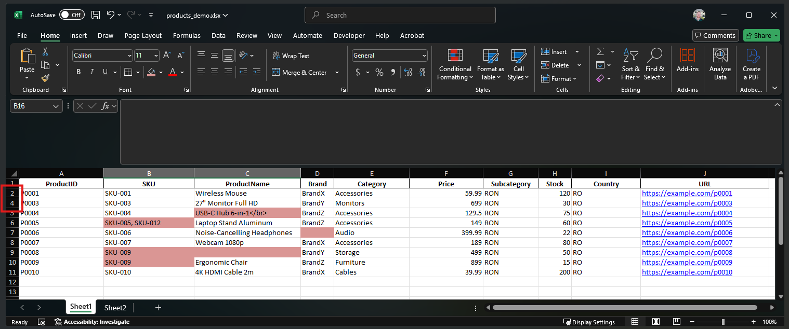

# Excel Catalog Validator

A complete desktop application for validating Excel product catalogs, built in **Python** with **Tkinter**, **Pandas**, and **OpenPyXL**.  
The app allows users to upload Excel files, run multiple data integrity checks, and generate structured error reports.

---

## ✨ Features
- **User Interface (Tkinter)** for file selection and sheet mapping.
- **Validation checks**:
  - Mandatory field completeness.
  - Uniqueness on key columns (e.g., ProductID, SKU).
  - Detection of hidden rows and columns.
  - Invalid characters, Excel formulas, HTML tags.
  - URL format validation (text and hyperlinks).
- **Error Reporting**:
  - Export structured fail reports into a separate Excel file.
  - Errors grouped by validation rule.
  - Includes cell references for easier review.
- **Performance**: tested with catalogs up to **65,000+ rows**.
- **Packaged executable**: built with **PyInstaller** (Windows `.exe`).
---

## 📂 Project Structure

- **data/**
  - `products_demo.xlsx` → Demo Excel file with fake product data
- `downloadfailreport.py` → Fail report generator
- `main.py` → Entry point / launcher
- `offline_app.py` → Tkinter GUI
- `validator.py` → Validation logic
- `README.md` → Project documentation
- `requirements.txt` → Dependencies
- `LICENSE` → MIT License

## 🛠 Tech Stack
- Python 3.10+
- Tkinter (GUI)
- Pandas (data validation & processing)
- NumPy (data handling, array operations)
- OpenPyXL (Excel file integration)
- PyInstaller (packaging into Windows executable)

## 🚀 How to Run 

1. Clone this repository:
   ```bash
   git clone https://github.com/AlexOn91/excel-catalog-validator.git
   cd excel-catalog-validator ```
3. Install dependencies:
    pip install -r requirements.txt
4. Run the application:
    python main.py
    
## 📸 Screenshots

Below is a full demo flow of the Excel Catalog Validator:

1. **Example input Excel file (demo)**  
   The validator works with product catalogs in Excel format.  
   This sample file includes intentional errors: duplicate SKUs, hidden rows, and multiple identifiers in one cell.  
   

2. **Load file and select sheet**  
   Users can load an Excel file and choose the worksheet to validate.  
   

3. **Map & rename columns**  
   Flexible mapping between the catalog fields and required properties.  
   

4. **Validation results (part 1)**  
   High-level checks for file format, hidden rows/columns, mandatory field completeness, and invalid characters.  
   

5. **Validation results (part 2)**  
   Advanced checks for uniqueness, URLs, character limits, and per-cell constraints.  
   

6. **Exported fail report (Excel)**  
   A structured fail report is generated, grouping all detected errors.  
   Each error includes explanations and **cell references** for quick navigation.  
   Example: HTML tag found in a product name.  
   
